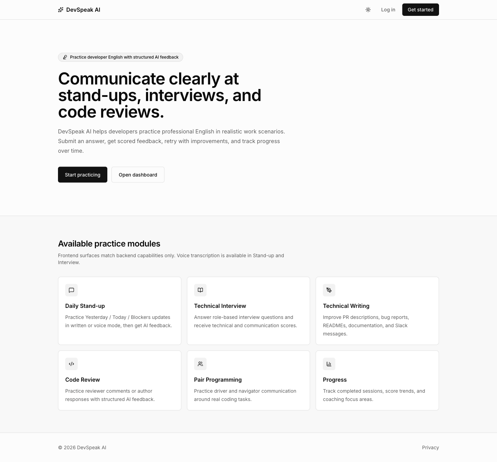
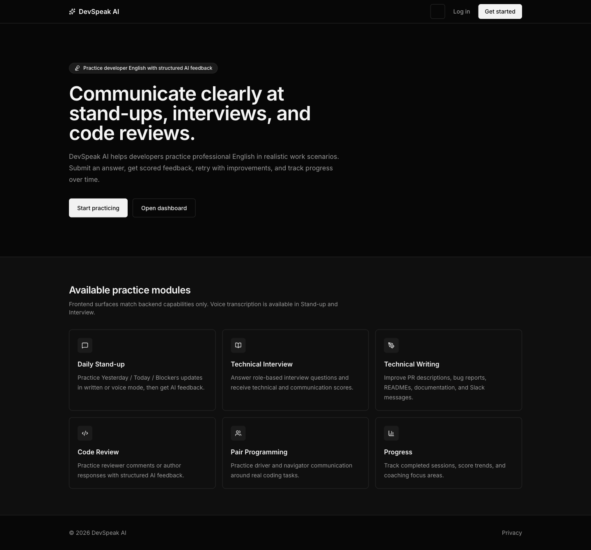
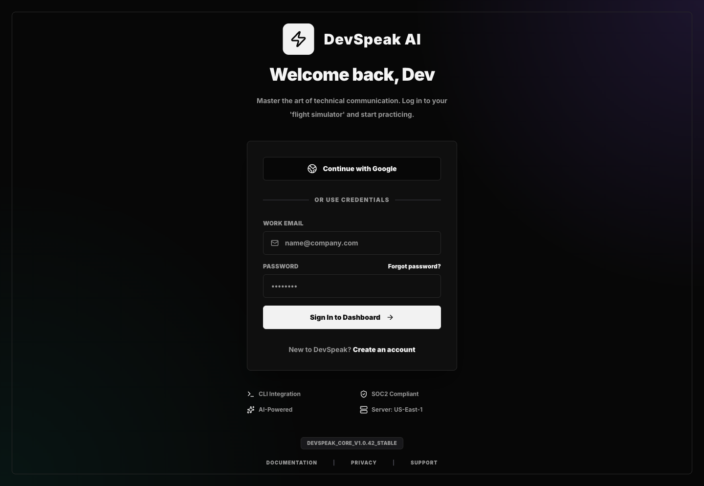

# DevSpeak AI

**An AI practice studio for developer English.**

DevSpeak AI helps software engineers practice the English they actually use at work: daily stand-ups, technical interviews, pull requests, code reviews, and pair programming.

It is not a vocabulary app and not a general English course. You answer a realistic workplace task, get structured AI coaching, retry with a better version, and watch your scores over time.

<p align="center">
  
  
</p>

<p align="center">Landing page in light and dark theme.</p>

## Problem

Many developers can write code, but struggle to communicate that work in English:

- stand-up updates that ramble or skip blockers
- interview answers that are technically right but poorly structured
- PRs, bug reports, and Slack messages that sound unclear or too abrupt
- code-review comments that are either too soft or too harsh
- pair-programming talk that loses the other person

DevSpeak AI turns those moments into short, repeatable practice sessions with measurable feedback.

## Who it is for

- Junior to mid-level developers targeting remote or international teams
- Engineers around **B1–B2 English** who need workplace fluency, not grammar drills
- Anyone who wants to rehearse stand-ups, interviews, and written technical communication before doing them live

## What you can practice

| Module | Scenario | Input | What the AI scores |
| --- | --- | --- | --- |
| **Daily Stand-up** | Yesterday / Today / Blockers | Text or voice | Clarity, structure, completeness |
| **Technical Interview** | Role-based interview questions | Text or voice | Technical accuracy, depth, communication |
| **Technical Writing** | PR, bug report, README, docs, Slack | Text | Tone, structure, usefulness |
| **Code Review** | Reviewer comment or author reply | Text | Diplomacy, specificity, actionability |
| **Pair Programming** | Driver or navigator talk | Text | Clarity of instruction and collaboration |
| **Progress** | Your history | — | Trends, focus areas, completed sessions |

Voice transcription is available in **Stand-up** and **Interview** only. The interface shows what the backend can actually do.

## Practice loop

Every module follows the same flow:

1. Pick a context (role, task type, or scenario).
2. Write an answer, or record voice and confirm the transcript.
3. Submit once. Duplicate submits are blocked with a request id.
4. Receive structured feedback: overall score, summary, strengths, improvements, an improved answer, and category scores.
5. Retry with the improved answer, or load an earlier attempt from history.
6. The session is saved. Dashboard and Progress update from completed work only.

```text
Sign in → coaching profile
       → choose a module
       → answer
       → AI evaluation
       → retry
       → dashboard / progress
```

## Product screenshots

### Landing

The public page states the product in one screen: who it is for, what you practice, and that voice exists only where transcription is wired.


### Sign in

Email/password and Google sign-in. After authentication, incomplete profiles go to onboarding; everyone else lands on the dashboard.



Inside the app, a single collapsible sidebar stays on Dashboard, all five practice modules, Progress, Profile, and Settings. Theme can be light, dark, or system.

## Architecture

```text
Browser  →  Next.js App Router
                │
                ├── Middleware   session + protected routes
                ├── Pages        practice UI, dashboard, settings
                └── API routes   validate → rate-limit → AI → persist
                                      │
                          ┌───────────┴───────────┐
                          ▼                       ▼
                     Google Gemini           Supabase Postgres
                     evaluate / transcribe   RLS, own-data only
```

- **Auth:** Supabase email/password and Google OAuth, cookie sessions.
- **Data:** profiles, practice sessions, evaluations, and AI run logs. Row Level Security keeps each user’s data private.
- **AI:** Gemini evaluates answers against Zod schemas. Voice audio is transcribed in memory and is not stored.
- **Safety:** authenticated routes, request size limits, schema validation, rate limits, and prompt isolation for user-provided text.

Deleting an account removes the profile, sessions, evaluations, and AI logs for that user.

## Tech stack

| Layer | Choice |
| --- | --- |
| App | Next.js 15, React 19, TypeScript |
| UI | Tailwind CSS, Headless UI, Lucide |
| Auth & database | Supabase Auth + PostgreSQL + RLS |
| AI | Google Gemini |
| Validation & tests | Zod, Vitest |

## Run locally

```bash
npm install
cp .env.example .env.local
```

Required environment variables:

```bash
NEXT_PUBLIC_SITE_URL=http://localhost:3000
GEMINI_API_KEY=
NEXT_PUBLIC_SUPABASE_URL=
NEXT_PUBLIC_SUPABASE_PUBLISHABLE_KEY=
SUPABASE_SERVICE_ROLE_KEY=
```

Apply the SQL in `supabase/migrations` to your Supabase project, then:

```bash
npm run dev
```

Open [http://localhost:3000](http://localhost:3000).

```bash
npm run type-check
npm run test
npm run lint
npm run build
```

## Repository map

```text
app/            pages and API routes
components/     app shell, voice recorder, shared UI
lib/ai/         prompts, schemas, evaluation, transcription
lib/auth/       session and middleware
lib/database/   persistence
supabase/       migrations and RLS tests
tests/          contract and security tests
docs/screenshots/
```

## Privacy in one paragraph

Answers, transcripts, and evaluations belong to the signed-in user. Audio is transcribed on the server and discarded. Gemini keys stay on the server. The in-app Privacy page and Settings → Delete account cover the rest.
