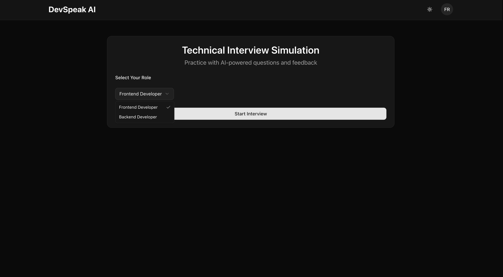

#
# DevSpeak AI — Practice Platform for Developer English Communication

DevSpeak AI is a professional practice platform that helps software engineers build strong English communication skills for the global tech industry. The app provides realistic, AI-powered simulations of day‑to‑day developer scenarios, delivers objective scores, and tracks progress over time in a personal dashboard.

## Why it’s a SaaS

- **Multi-tenant and authenticated**: Supabase Auth with secure, session-based access.
- **Secure backend-for-frontend**: App Router API routes call Google Gemini server-side; API keys never touch the client.
- **Persistent, per-user data**: Sessions and scores are stored per user and visualized in the dashboard.
- **Privacy by default**: Designed for Supabase Row Level Security (RLS) so users can only access their own data.
- **Cloud-native**: Built with Next.js and ready for Vercel-scale deployments.

## Core Modules

- **Stand‑up Simulation**: Practice daily updates and receive feedback with scores for clarity, conciseness, and impact.
- **Technical Interviews**: Evaluate responses on technical accuracy, depth, and clarity.
- **Code Review Practice**: Train as a reviewer (quality of review) or as an author (quality of code) with targeted feedback.
- **Pair Programming**: Driver/Navigator roles with role‑specific outputs and guidance.
- **Technical Writing**: Improve docs, emails, and blog posts along clarity, structure, tone, and completeness.
- **Progress Tracking**: Charts, trends, and insights to understand strengths and growth areas.

## How It Works

- **Frontend**: Built with Next.js App Router using React Server Components and Client Components where interactivity is required.
- **API routes (BFF)**: `app/api/*/route.ts` encapsulate prompts, AI calls, and data access.
- **AI integration**: `lib/geminiClient.ts` uses `GEMINI_API_KEY` to call Google Gemini on the server.
- **Auth & data**: Supabase Auth via cookies; practice sessions are logged through secure API routes; the dashboard aggregates results per user.

## Tech Stack

- **Framework**: Next.js (App Router) with TypeScript
- **AI**: Google Gemini (`@google/generative-ai`)
- **Auth & Database**: Supabase (PostgreSQL + Auth Helpers)
- **UI**: ShadCN UI + Radix UI, Tailwind CSS v4
- **Charts**: Recharts
- **Icons/Fonts**: Lucide, Geist Sans/Mono

## API Overview

- `POST /api/standup`
  - Body: `{ yesterday: string, today: string, blockers?: string }`
  - Returns: `{ clarity: number, conciseness: number, impact: number, feedback: string }`

- `POST /api/interview`
  - Body: `{ role: string, question: string, answer: string }`
  - Returns: `{ accuracy: number, depth: number, clarity: number, feedback: string }`

- `POST /api/code-review`
  - Reviewer body: `{ role: "reviewer", userReview: string, codeToReview: string }`
  - Author body: `{ role: "author", codeToReview: string }`
  - Returns (reviewer): `{ constructiveness, specificity, tone, feedback }`
  - Returns (author): `{ correctness, readability, bestPractices, feedback }`

- `POST /api/pair-programming`
  - Driver body: `{ role: "driver", task: string, code: string }`
  - Navigator body: `{ role: "navigator", instruction: string }`
  - Returns (driver): `{ correctness, efficiency, readability, feedback }`
  - Returns (navigator): `{ clarity, effectiveness, precision, generatedCode }`

- `POST /api/writing`
  - Body: `{ writingType: string, userContent: string }`
  - Returns: `{ clarity, structure, tone, completeness, feedback }`

- `GET /api/progress-data` (auth required)
  - Returns aggregated metrics for the dashboard: heatmap, module counts, trend lines, strengths/weaknesses, recent activity

- `POST /api/log-session` (auth required)
  - Body: `{ module_type: string, task_name?: string, scores?: object, user_input: string, ai_feedback: string }`
  - Persists a practice session for the authenticated user

## Screenshots


 





## Getting Started

### Prerequisites
 
- Node.js 18+
- npm or yarn
- Supabase project (URL + anon key)
- Google Gemini API key

### 1) Install

```bash
git clone <repository-url>
cd devspeak-ai
npm install
```

### 2) Environment Variables

Create a `.env.local` file with:

```bash
GEMINI_API_KEY=your_gemini_api_key
NEXT_PUBLIC_SUPABASE_URL=your_supabase_url
NEXT_PUBLIC_SUPABASE_ANON_KEY=your_supabase_anon_key
```

### 3) Supabase Table & RLS (recommended)

```sql
create table if not exists practice_sessions (
  id uuid primary key default gen_random_uuid(),
  user_id uuid not null,
  created_at timestamptz not null default now(),
  module_type text not null,
  task_name text,
  scores jsonb,
  user_input text not null,
  ai_feedback text not null
);

alter table practice_sessions enable row level security;

create policy "Users can read own sessions" on practice_sessions
  for select using (auth.uid() = user_id);

create policy "Users can insert own sessions" on practice_sessions
  for insert with check (auth.uid() = user_id);
```

### 4) Run

```bash
npm run dev
# open http://localhost:3000
```

### Scripts

- `npm run dev` – Start development server
- `npm run build` – Build for production
- `npm run start` – Start production server
- `npm run lint` – Run ESLint

## Project Structure

```
app/
  api/
    standup/route.ts
    interview/route.ts
    code-review/route.ts
    pair-programming/route.ts
    writing/route.ts
    log-session/route.ts
    progress-data/route.ts
  layout.tsx
  page.tsx
  modules/
    standup/page.tsx
    interview/page.tsx
    code-review/page.tsx
    pair-programming/page.tsx
    writing/page.tsx
    progress/page.tsx
components/
  ui/* (ShadCN UI)
lib/
  geminiClient.ts
styles/
  globals.css
```

## Deployment

1. Push to GitHub/GitLab
2. Import into Vercel and set environment variables
3. Connect to your Supabase project (RLS enabled)

## License

MIT

---

Built for developers learning English through real, day‑to‑day workflows.