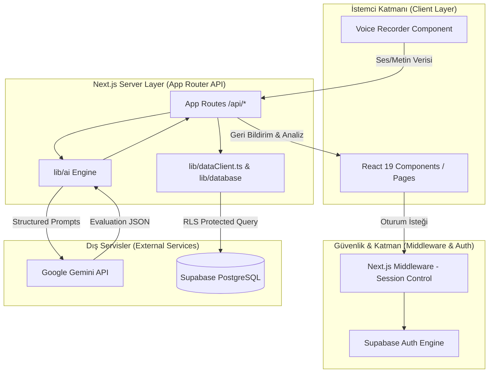

# DevSpeak AI - Mimari Dokümantasyon ve Geliştirme Rehberi

Bu doküman, **DevSpeak AI** platformunun teknik mimarisini, dizin yapısını, veri akışlarını ve geliştirme standartlarını ayrıntılı bir şekilde açıklamak amacıyla hazırlanmıştır. Yeni özellikler eklerken veya mevcut modülleri geliştirirken bu dokümanı rehber edinebilirsiniz.

---

## 1. 📌 Genel Bakış ve Amaç

**DevSpeak AI**, yazılımcıların ve teknik profesyonellerin (Software Engineers, Tech Leads, PMs) İngilizce teknik iletişim becerilerini (Standup, Code Review, Mülakatlar, Pair Programming vb.) geliştirmelerini sağlayan yapay zeka destekli bir eğitim ve simülasyon platformudur.

### Temel Özellikler:
* **Ses ve Yazı Simülasyonları**: Web Speech API / Ses kaydı ve doğrudan LLM değerlendirmesi.
* **Yapay Zeka Değerlendirmeleri**: Gramer, teknik terim kullanımı, akıcılık ve yanıt kalitesi analizi.
* **Isı Haritası & Analitik**: Kullanıcının pratik sürekliliğini ve performansını izleyen görsel grafikler.
* **Rol Tabanlı Senaryolar**: Teknik mülakat, code review ve günlük standup toplantısı simülasyonları.

---

## 2. 🛠️ Teknolojik Altyapı (Tech Stack)

| Katman | Teknoloji / Kütüphane | Açıklama |
| :--- | :--- | :--- |
| **Framework** | Next.js 15 (App Router), React 19, TypeScript | Sunucu ve istemci taraflı modern web mimarisi |
| **UI & Stil** | Tailwind CSS v4, Radix UI, Lucide Icons, Recharts | Modern UI/UX, erişilebilirlik ve veri görselleştirme |
| **Backend & DB** | Supabase (`@supabase/ssr`, `@supabase/supabase-js`) | PostgreSQL, Row Level Security (RLS), Auth |
| **AI Servisleri** | Google Gemini API (`@google/genai`), Zod | LLM transkripsiyonu, değerlendirme ve yapılandırılmış çıktılar |
| **Test** | Vitest | Birim ve entegrasyon testleri |

---

## 3. 🏗️ Mimari Şema ve Veri Akışı



---

## 4. 📁 Dizin Yapısı ve Sorumluluklar

```text
devspeak-ai/
├── app/                        # Next.js App Router (Sayfalar ve API Uç Noktaları)
│   ├── (auth pages)/           # login, onboarding, forgot-password, update-password
│   ├── analytics/              # Analiz ve gelişim detayları sayfası
│   ├── dashboard/              # Ana kullanıcı paneli ve özet istatistikler
│   ├── modules/                # Pratik modülleri (interview, code-review, standup vb.)
│   └── api/                    # Sunucu taraflı API uç noktaları
│       ├── account/            # Profil güncelleme uç noktaları
│       ├── code-review/        # Code review simülasyon API'si
│       ├── interview/          # Mülakat simülasyon API'si
│       ├── pair-programming/   # Pair programming simülasyon API'si
│       ├── standup/            # Standup simülasyon API'si
│       ├── voice/              # Ses işleme & transkripsiyon API'si
│       └── log-session/        # Oturum kaydı ve skorlama API'si
├── components/                 # UI Bileşenleri
│   ├── ui/                     # Radix UI temelli primitif bileşenler (Button, Dialog, Tab vb.)
│   ├── ActivityHeatmap.tsx     # Kullanıcı aktivite ısı haritası
│   ├── VoiceRecorder.tsx       # Ses kayıt & Web Speech API bileşeni
│   ├── DashboardLayout.tsx     # Ana panel düzeni ve navigasyon
│   └── ProfileForm.tsx         # Profil düzenleme formu
├── lib/                        # Çekirdek İş Mantığı & Yardımcı Kütüphaneler
│   ├── ai/                     # Google Gemini entegrasyonu ve prompt motoru
│   │   ├── client.ts           # Gemini SDK istemcisi
│   │   ├── evaluate.ts         # Konuşma / metin değerlendirme mantığı
│   │   ├── generate.ts         # Senaryo ve soru üretme motoru
│   │   ├── transcribe.ts       # Ses kayıtlarını metne çevirme (Audio-to-Text)
│   │   ├── schemas.ts          # AI yanıtları için Zod şemaları
│   │   └── prompts/            # Modüllere özel sistem promptları
│   ├── auth/                   # Supabase istemci ve sunucu session yönetimi
│   ├── database/               # PostgreSQL sorguları ve veri erişim modelleri
│   ├── dataClient.ts           # Veritabanı istemci arayüzü (Loglar, skorlar, analitikler)
│   └── validation/             # API istek ve yanıt doğrulama şemaları (Zod)
└── supabase/                   # Veritabanı Migrasyonları ve Yapılandırma
    └── migrations/             # SQL şemaları, tablo tanımları ve RLS politikaları
```

---

## 5. 🔐 Güvenlik ve Kimlik Doğrulama (Auth & Security)

1. **Supabase SSR Auth**: `middleware.ts` dosyası, oturum açmamış kullanıcıları otomatik olarak `/login` sayfasına yönlendirir.
2. **Row Level Security (RLS)**: Veritabanındaki tüm tablolar (`profiles`, `evaluations`, `interview_scenarios` vb.) RLS politikaları ile korunur. Kullanıcılar yalnızca kendi `user_id` değerlerine ait verileri okuyabilir ve yazabilir.
3. **Server-Only API Logic**: AI istekleri ve hassas veritabanı işlemleri istemci tarafında değil, sunucu tarafındaki Next.js API rotalarında (`app/api/*`) gerçekleştirilir.

---

## 6. 🛠️ Yeni Özellik / Modül Ekleme Rehberi

Projeye yeni bir pratik modülü (örneğin: *Technical Presentation*) eklerken izlenmesi gereken adımlar:

1. **Zod Şeması Tanımlama (`lib/ai/schemas.ts`)**:
   * AI'dan dönmesi beklenen çıktı yapısını (skor, geri bildirimler, gramer hataları) tanımlayın.
2. **Prompt Oluşturma (`lib/ai/prompts/`)**:
   * Modüle özel rol, amaç ve değerlendirme kriterlerini içeren bir sistem promptu hazırlayın.
3. **API Uç Noktası Açma (`app/api/[yeni-modul]/route.ts`)**:
   * Kullanıcı oturumunu doğrulayın (`getCurrentUser`).
   * Gemini API ile değerlendirmeyi çalıştırın (`evaluate.ts` veya `generate.ts`).
   * Sonucu `lib/dataClient.ts` üzerinden Supabase'e kaydedin.
4. **UI Sayfası ve Bileşeni Oluşturma (`app/modules/[yeni-modul]/page.tsx`)**:
   * `VoiceRecorder.tsx` bileşenini ve ilgili formları kullanarak interaktif arayüzü tasarlayın.

---

## 7. 🧪 Test ve Kalite Kontrol

* **Test Koşumu**: `npm run test` komutu ile Vitest birim testlerini çalıştırabilirsiniz.
* **Tip Kontrolü**: `npm run type-check` ile TypeScript tiplerini doğrulayabilirsiniz.
* **Linting**: `npm run lint` ile kod standartlarını kontrol edebilirsiniz.
